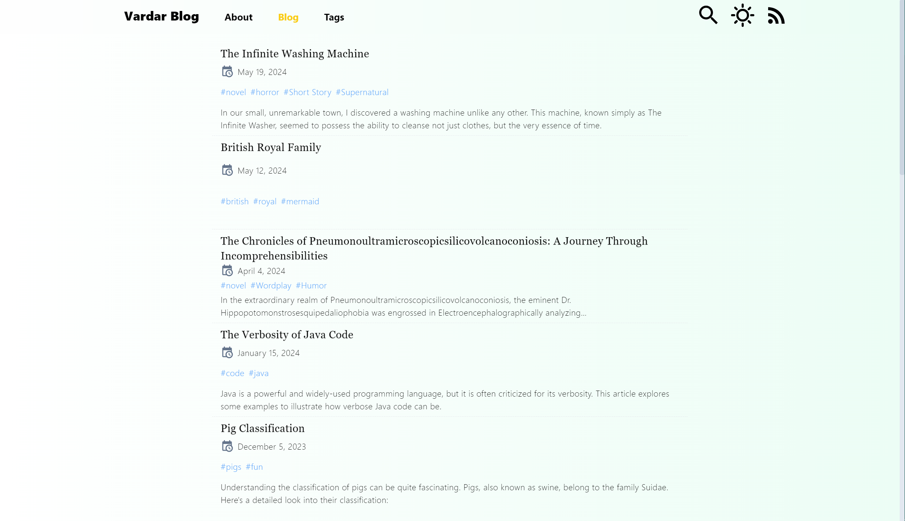
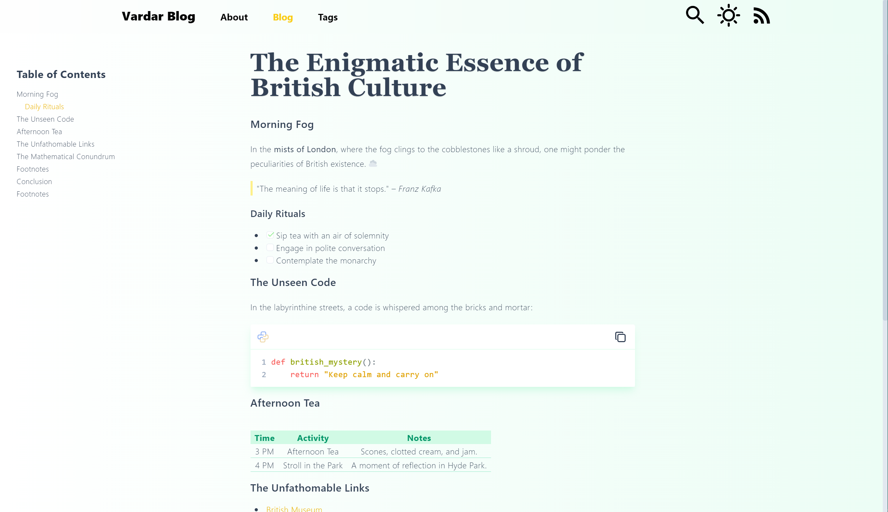

# Vardar

**欢迎使用 Vardar!** 🚀






一个基于 **Nuxt Content** 和 **Tailwind CSS** 的个人博客框架。

示例网站：[https://vardar-example.xyz/](https://vardar-example.xyz/)

## 主要功能

- **即时添加文章**：只需将 `.md` 文件放入 `/content/blog` 文件夹即可添加新文章。
- **主题色支持**：通过编辑 `tailwind.config.js` 里的 `themeColor` 实现主题色变换
- （支持的颜色有 'zinc', 'gray', 'red', 'orange', 'amber', 'yellow', 'lime', 'green', 'emerald', 'teal', 'cyan', 'sky', 'blue', 'indigo', 'violet', 'purple', 'fuchsia', 'pink', 'rose'）;
- **RSS 支持**：可通过 `/feed.xml` 获取博客更新。
- **Mermaid 支持**：使用 mermaid 在文章中创建美观的图表。
- **GFM Markdown 支持**。
- **KaTeX 支持**：可使用 KaTeX 在文章中插入数学表达式。
- **i18n 支持**

## 快速开始

1. **安装依赖**：

   ```bash
   pnpm install
   ```

2. **启动开发服务器**：

   ```bash
   pnpm run dev
   ```

3. **生产环境部署**：

   ```bash
   pnpm run build
   ```

   ```bash
   node .output/server/index.mjs
   ```

Happy Blogging！

[](https://vercel.com/new/clone?repository-url=https%3A%2F%2Fgithub.com%2Fhanyujie2002%2FVardar)
