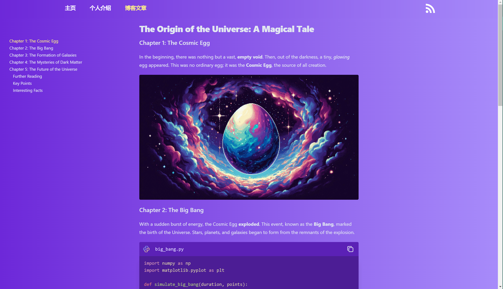

# Vardar

**Welcome to Vardar!** 🚀




A personal blog framework built on **Nuxt.js** and **Nuxt Content**.

## Key Features

- **Instant Blog Addition**: Add new blogs by dropping a `.md` file into the `/content/blog` folder.
- **Theme Support**: Choose your color theme for a personalized look and feel.
- **Paginated Blog Menu**: Easily navigate through blogs with our paginated menu at `/blog`.
- **RSS Support**: Get your blog updates with RSS feed at `/feed.xml`.
- **Table of Contents**: Navigate your posts with ease using the table of contents.
- **Sticky Header**: The header sticks to the top of the page for easy navigation.
- **Mermaid Support**: Create beautiful and interactive diagrams directly in your blog posts using the ` ```mermaid ``` ` syntax.
- **GFM Markdown Support**: Write your blog posts using GitHub Flavored Markdown (GFM) for enhanced formatting options.
- **KaTeX Support**: Include mathematical expressions in your blog posts using KaTeX for high-quality typesetting.

## Quick Start

1. **Install Dependencies**:

   ```bash
   pnpm install
   ```

2. **Start Development Server**:

   ```bash
   pnpm run dev
   ```

3. **Production**:

   ```bash
   pnpm run build
   ```

   ```bash
   node .output/server/index.mjs
   ```

Happy blogging! ✍️

[](https://vercel.com/new/clone?repository-url=https%3A%2F%2Fgithub.com%2Fhanyujie2002%2FVardar)
