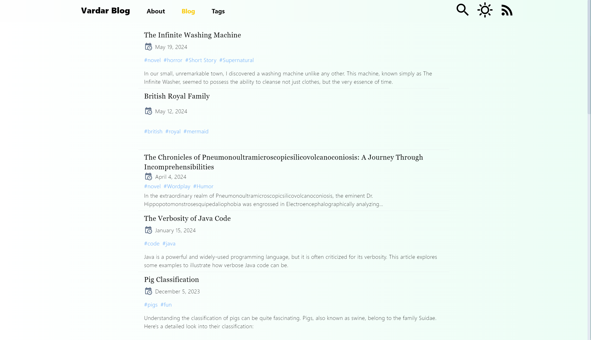

[中文](./README-zh.md)

# Vardar

**Welcome to Vardar!** 🚀





A personal blog framework built on **Nuxt Content** and **Tailwind CSS**.

Demo site: [https://vardar-example.xyz/](https://vardar-example.xyz/)

## Key Features

- **Instant Blog Addition**: Add new articles by simply placing a `.md` file into the `/content/blog` folder.
- **Theme Color Support**: Change the theme color by editing the `themeColor` in `tailwind.config.js` (supported colors include 'zinc', 'gray', 'red', 'orange', 'amber', 'yellow', 'lime', 'green', 'emerald', 'teal', 'cyan', 'sky', 'blue', 'indigo', 'violet', 'purple', 'fuchsia', 'pink', 'rose').
- **RSS Support**: Get blog updates via `/feed.xml`.
- **Mermaid Support**: Create beautiful diagrams in your articles using mermaid.
- **GFM Markdown Support**.
- **KaTeX Support**: Insert mathematical expressions in your articles using KaTeX.
- **i18n Support**

## Quick Start

1. **Install Dependencies**:

   ```bash
   pnpm install
   ```

2. **Start Development Server**:

   ```bash
   pnpm run dev
   ```

3. **Production Deployment**:

   ```bash
   pnpm run build
   ```

   ```bash
   node .output/server/index.mjs
   ```

Happy Blogging!

[](https://vercel.com/new/clone?repository-url=https%3A%2F%2Fgithub.com%2Fhanyujie2002%2FVardar)
